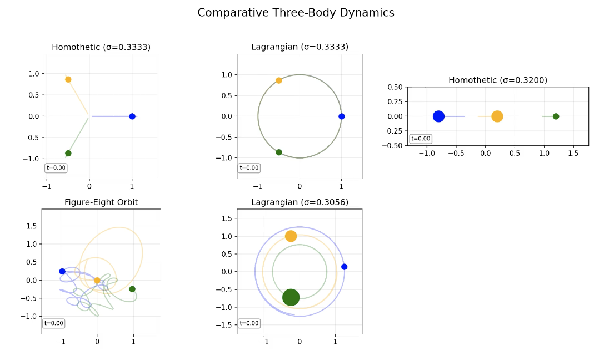

# Unified Framework for the Three-Body Problem

[See Research Paper](https://docs.google.com/viewerng/viewer?url=https://framerusercontent.com/assets/4CFTLBQYF8Umlwj7IaGQ3lPJtk.pdf)

[](figures/animations/three_body_scenarios_comparative.mp4)

This repository implements the unified theoretical framework that establishes rigorous isomorphisms between three distinct mathematical approaches to the three-body problem: Differential Galois Theory, Painlevé Analysis, and Quaternionic Regularization.

## Overview

The three-body problem—describing the motion of three bodies under mutual gravitational attraction—remains one of the fundamental challenges in mathematical physics. This implementation connects three mathematical approaches through precise isomorphisms:

1. **Differential Galois Theory (DGT)**: An algebraic approach examining the structure of differential field extensions generated by solutions to variational equations.
2. **Painlevé Analysis (PA)**: A complex-analytic approach examining the singularity structure of solutions.
3. **Quaternionic Regularization (QR)**: A geometric approach that extends the domain of solutions from complex to quaternionic space.

The key insight of this work is that these three perspectives are connected through precise mathematical isomorphisms, providing a powerful unified framework for analyzing the three-body problem.

## Installation

### Prerequisites

The implementation requires Python 3.10+ and the following dependencies:

```bash
pip install numpy scipy sympy matplotlib pandas
```

### Clone the Repository

```bash
git clone https://github.com/username/three-body-isomorphisms.git
cd three-body-isomorphisms
```

## Project Structure

The implementation is divided into several modules:

- `quaternion.py`: Implementation of quaternion algebra
- `three_body_problem.py`: Implementation of the three-body problem, homothetic orbits, and Lagrangian solutions
- `differential_galois.py`: Implementation of Differential Galois Theory analysis
- `painleve_analysis.py`: Implementation of Painlevé Analysis
- `quaternionic_regularization.py`: Implementation of Quaternionic Regularization methods
- `isomorphism_verification.py`: Implementation of isomorphism verification
- `kam_theory.py`: Implementation of KAM Theory integration
- `visualization.py`: Implementation of visualization tools
- `benchmark.py`: Implementation of benchmarking infrastructure

## Running Tests

Each module includes comprehensive tests that can be run individually to verify its functionality:

```bash
# Run tests for the quaternion module
python quaternion.py

# Run tests for the three-body problem module
python three_body_problem.py

# Run tests for the differential Galois theory module
python differential_galois.py

# Run tests for the Painlevé analysis module
python painleve_analysis.py

# Run tests for the quaternionic regularization module
python quaternionic_regularization.py

# Run tests for the isomorphism verification module
python isomorphism_verification.py

# Run tests for the KAM theory integration module
python kam_theory.py

# Run tests for the visualization module
python visualization.py
```

You can also run a quick benchmark test to ensure the entire framework is functioning correctly:

```bash
python benchmark.py --test
```

## Running Benchmarks

### Full Benchmark

To generate all results, tables, and visualizations described in the paper:

```bash
python benchmark.py --output-dir results
```

This command will:
1. Verify isomorphisms for homothetic orbits
2. Verify isomorphisms for Lagrangian solutions
3. Run benchmarks for both types of orbits
4. Analyze isomorphism verification performance
5. Generate KAM theory integration results
6. Create visualizations and tables

The results will be saved in the specified output directory (default: `results/`).

### Verification Only

To run only the verification benchmarks (faster):

```bash
python benchmark.py --verify-only --output-dir results
```

## Examining Results

The benchmark process generates several types of outputs:

### CSV Files
- `homothetic_isomorphisms.csv`: Isomorphism verification results for homothetic orbits
- `lagrangian_isomorphisms.csv`: Isomorphism verification results for Lagrangian solutions
- `homothetic_performance.csv`: Performance benchmarks for homothetic orbits
- `lagrangian_performance.csv`: Performance benchmarks for Lagrangian solutions
- `verification_performance.csv`: Performance metrics for isomorphism verification
- `isomorphism_kam_correspondence.csv`: Correspondence between isomorphisms and KAM theory
- `kam_measure.csv`: KAM measure values for different mass parameters

### LaTeX Tables
- `table_homothetic_isomorphisms.tex`: Table of isomorphic structures in homothetic orbits
- `table_lagrangian_isomorphisms.tex`: Table of quaternionic regularization and isomorphic structures for Lagrangian solutions
- `table_verification_performance.tex`: Performance of isomorphism verification for near-exceptional case
- `table_isomorphism_kam_correspondence.tex`: Correspondence between isomorphism structures and KAM theory

### Visualizations
- `homothetic_isomorphisms.png`: Parameter space of homothetic orbit isomorphisms
- `lagrangian_isomorphisms.png`: Parameter space of Lagrangian solution isomorphisms
- `homothetic_trajectory_*.png`: Trajectories for homothetic orbits
- `lagrangian_trajectory_*.png`: Trajectories for Lagrangian solutions
- `integration_diagram_*.png`: Visual representations of isomorphisms
- `branching_structure_*.png`: Branching structures in the complex plane
- `quaternionic_manifold_*.png`: Quaternionic branch manifolds
- `kam_measure.png`: KAM measure vs. mass parameter

## Key Mass Parameters

The implementation pays special attention to three exceptional mass ratios that yield partially integrable systems:

1. σ = 1/3
2. σ = 2³/3³
3. σ = 2/3²

These exceptional cases exhibit specific isomorphism structures that are verified and analyzed throughout the implementation.

## Interpreting the Results

The implementation verifies the following key claims:

1. **Three-Way Isomorphism**: The differential Galois group structure, Painlevé branching behavior, and quaternionic monodromy are isomorphic mathematical structures.

2. **Unified Integrability Criterion**: The abelian nature of the differential Galois group, the Painlevé property, and trivial quaternionic monodromy are equivalent conditions for integrability.

3. **Exceptional Mass Ratios**: The exceptional mass ratios (σ = 1/3, σ = 2³/3³, σ = 2/3²) exhibit specific isomorphism structures that correspond to partial integrability.

4. **KAM Theory Integration**: The isomorphism structures are reflected in the measure of phase space occupied by KAM tori, with peaks at the exceptional mass ratios.
